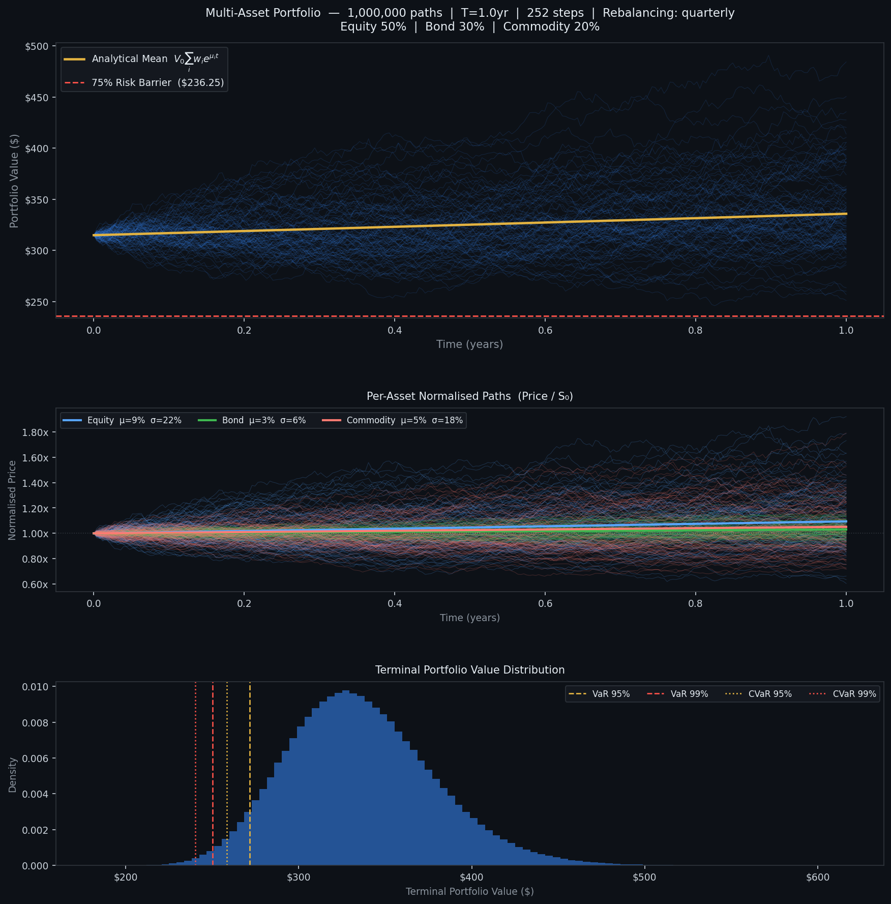

# Driftline — High-Performance GBM Portfolio Simulator

Driftline is a high-performance Monte Carlo simulation engine for multi-asset portfolios under correlated Geometric Brownian Motion. It generates over one million price paths using fully vectorized matrix operations, with optional periodic rebalancing.

---

## Overview

This simulator models the joint evolution of an arbitrary number of assets under GBM, including cross-asset correlations via Cholesky decomposition. Portfolio values are computed at each timestep and passed to a vectorized risk engine that computes Value at Risk, Conditional VaR, and barrier breach probability. An optional rebalancing engine periodically resets holdings to target weights without modifying the path generation layer.

The design separates concerns cleanly into three independent stages:

```
_worker()                        → price paths  (n_paths, n_assets, n_steps+1)
compute_portfolio_values()       → portfolio PV (n_paths, n_steps+1)
compute_risk()                   → RiskMetrics
```

Each stage is fully vectorized. No Python loops iterate over paths or timesteps.

---

## Mathematical Foundations

### Geometric Brownian Motion

Each asset $i$ evolves according to the stochastic differential equation:

$$dS_i(t) = \mu_i S_i(t)\, dt + \sigma_i S_i(t)\, dW_i(t)$$

where $\mu_i$ is the annualized drift, $\sigma_i$ is the annualized volatility, and $W_i(t)$ is a standard Wiener process. The exact discrete solution over a timestep $\Delta t = T / N$ is:

$$S_i(t + \Delta t) = S_i(t) \cdot \exp\!\left[\left(\mu_i - \tfrac{1}{2}\sigma_i^2\right)\Delta t + \sigma_i \sqrt{\Delta t}\, Z_i\right]$$

where $Z_i \sim \mathcal{N}(0, 1)$. This is the Itô-correct form. The $-\frac{1}{2}\sigma_i^2$ term corrects for the convexity of the exponential under the log-normal distribution, ensuring $\mathbb{E}[S_i(t)] = S_{0,i}\, e^{\mu_i t}$. Without it, the simulated paths would have a systematically high mean.

### Correlated Shocks via Cholesky Decomposition

Asset dependence is captured through a symmetric positive semi-definite correlation matrix $\rho \in \mathbb{R}^{n \times n}$ with unit diagonal. To generate correlated shocks from independent standard normals, the Cholesky factorization produces a lower triangular matrix $L$ such that:

$$\rho = L L^\top$$

Independent draws $Z \sim \mathcal{N}(0, I)$ are transformed to:

$$Z_{\text{corr}} = Z L^\top$$

yielding $\mathbb{E}[Z_{\text{corr}} Z_{\text{corr}}^\top] = L L^\top = \rho$. 

In the implementation, $Z$ has shape:

$$
(N_{\text{paths}}, N_{\text{steps}}, N_{\text{assets}})
$$

with the asset axis placed last. This allows $Z L^\top$ to be executed as a single BLAS matrix multiplication without intermediate copies.

### Portfolio Value

Let $w_i$ be the fractional weight of asset $i$ with $\sum_i w_i = 1$, and $V_0 = \sum_i S_{0,i}$ the initial portfolio value. The number of shares held in asset $i$ at inception is:

$$\text{shares}_i = \frac{w_i V_0}{S_{0,i}}$$

Portfolio value at time $t$ is then:

$$V(t) = \sum_{i=1}^{n} \text{shares}_i \cdot S_i(t) = V_0 \sum_{i=1}^{n} \frac{w_i S_i(t)}{S_{0,i}}$$

The analytical expectation, used as the mean reference path in plots, is:

$$\mathbb{E}[V(t)] = V_0 \sum_{i=1}^{n} w_i e^{\mu_i t}$$

### Portfolio Rebalancing

At each rebalancing date $t_r$, the portfolio is reset to the target weights. Share holdings are updated as:

$$\text{shares}_i(t_r^+) = \frac{w_i \cdot V(t_r)}{S_i(t_r)}$$

This operation conserves portfolio value. No cash enters or leaves, and it eliminates drift from the target allocation caused by differential asset growth. The procedure is implemented in `compute_portfolio_values()` as a loop over rebalancing events (at most `T × freq` iterations), each fully vectorized over all paths simultaneously. `_worker()` is completely unaffected.

### Value at Risk and Conditional VaR

Let $L = V_0 - V_T$ denote the terminal loss (positive = money lost). Given significance level $\alpha$:

$$\text{VaR}_\alpha = F_L^{-1}(\alpha)$$

$$\text{CVaR}_\alpha = \mathbb{E}\!\left[L \;\middle|\; L \geq \text{VaR}_\alpha\right]$$

CVaR, also called Expected Shortfall, is the mean loss in the tail beyond VaR. Both are computed with `np.percentile` and a boolean mask, with no loops.

---

## Architecture

### Data Layout

```
asset_paths      : float32  (n_paths, n_assets, n_steps+1)  C-order, row-major
portfolio_values : float32  (n_paths, n_steps+1)
```

Assets occupy axis 1. The time axis is last. `np.cumprod(axis=2)` traverses each row sequentially in memory, which is cache-optimal under C-order layout.

`float32` halves memory bandwidth relative to `float64`. For a 3-asset simulation at 1M paths × 252 steps, `asset_paths` occupies approximately 1.44 GB in float32 versus 2.88 GB in float64. Switch `params.dtype = np.float64` when sub-cent precision is required.

### Concurrency Model

`ThreadPool` (OS threads, not subprocesses) is used. NumPy releases the Python GIL during C-extension calls, so the compute-heavy operations (`rng.standard_normal`, `np.exp`, `Z @ L.T`, `np.cumprod`) all execute in parallel across the threads. Each thread operates on a contiguous slice of paths with its own RNG state. The results are then combined with a single `np.concatenate` call.

Path slices are distributed evenly across worker threads in the ThreadPool, with any remainder assigned to the first workers.

### Rebalancing Architecture

The implementation places rebalancing entirely within `compute_portfolio_values()` rather than `_worker()`. Asset prices evolve according to GBM independent of portfolio-level operations. It operates on prices and does not generate price paths.

The segment-based approach:

```
boundaries = [0, rebal_steps, 2*rebal_steps, ..., n_steps]

for each segment [a, b]:
    seg_pv = (shares * prices[:, :, a:b+1]).sum(axis=1)  ← vectorized over all paths
    update shares at b                                    ← vectorized over all paths
```

The loop iterates over rebalancing events (4 for quarterly), not over paths (1,000,000) or steps (252).

---

## Installation

```bash
pip install numpy matplotlib
```

Python 3.10+ is required for the `dict[str, ...]` type annotation syntax. No other dependencies.

---

## Usage

### Running the Default Benchmark

```python
from gbm_simulator import benchmark, REBAL_FREQ

# Default: 1M paths, 252 steps, quarterly rebalancing, 3 runs
benchmark()

# Disable rebalancing
benchmark(rebal_steps=None)

# Annual rebalancing, 5 runs, no plot
benchmark(rebal_steps=REBAL_FREQ["annual"], runs=5, plot=False)

# Custom interval: every 20 steps
benchmark(rebal_steps=20)
```

### `benchmark()` Parameters

| Parameter | Type | Default | Description |
|---|---|---|---|
| `n_paths` | `int` | `1_000_000` | Total Monte Carlo paths |
| `n_steps` | `int` | `252` | Discrete timesteps (252 = daily, one trading year) |
| `T` | `float` | `1.0` | Simulation horizon in years |
| `runs` | `int` | `3` | Timed repetitions; reports best / worst / mean / stddev |
| `rebal_steps` | `Optional[int]` | `REBAL_FREQ["quarterly"]` | Rebalancing interval in steps; `None` disables |
| `plot` | `bool` | `True` | Save `simulation_results.png` to the working directory |

### Using the Simulator Directly

```python
import numpy as np
from gbm_simulator import GBMParams, GBMSimulator, compute_risk, REBAL_FREQ

params = GBMParams(
    S0      = np.array([100.0, 95.0, 120.0]),
    mu      = np.array([0.09,  0.03,  0.05]),
    sigma   = np.array([0.22,  0.06,  0.18]),
    weights = np.array([0.50,  0.30,  0.20]),
    rho     = np.array([
        [1.00, 0.25, 0.10],
        [0.25, 1.00, 0.05],
        [0.10, 0.05, 1.00],
    ]),
    T           = 1.0,
    n_steps     = 252,
    n_paths     = 500_000,
    rebal_steps = REBAL_FREQ["monthly"],
    names       = ["Equity", "Bond", "Commodity"],
)

result = GBMSimulator(params).run()

print(result.asset_paths.shape)       # (500_000, 3, 253)
print(result.portfolio_values.shape)  # (500_000, 253)

risk = compute_risk(result.portfolio_values, params)
print(f"VaR 95%:  ${risk.var_95:.2f}")
print(f"CVaR 99%: ${risk.cvar_99:.2f}")
print(f"Barrier breach: {risk.barrier_breach * 100:.3f}%")
```

---

## `GBMParams` Reference

| Field | Type | Description |
|---|---|---|
| `S0` | `array (n,)` | Initial asset prices |
| `mu` | `array (n,)` | Annualized drift rates |
| `sigma` | `array (n,)` | Annualized volatilities |
| `weights` | `array (n,)` | Fractional allocation weights; must sum to 1.0 |
| `rho` | `array (n, n)` | Correlation matrix; symmetric, PSD, unit diagonal |
| `T` | `float` | Simulation horizon in years |
| `n_steps` | `int` | Number of discrete time steps |
| `n_paths` | `int` | Total Monte Carlo paths |
| `rebal_steps` | `Optional[int]` | Rebalancing interval in steps; `None` = no rebalancing |
| `names` | `list[str]` | Asset labels for output; auto-generated if omitted |
| `dtype` | `type` | Storage dtype for path arrays; default `np.float32` |
| `L` | `array (n, n)` | Cholesky factor; computed automatically, read-only |

### Rebalancing Frequency Constants

```python
REBAL_FREQ = {
    "daily":      1,    # every step
    "weekly":     5,
    "monthly":   21,
    "quarterly": 63,
    "semiannual": 126,
    "annual":    252,   # once per year (assumes n_steps=252)
    "never":    None,   # equivalent to rebal_steps=None
}
```

All values assume `n_steps=252`. For non-standard step counts, compute the equivalent interval manually and pass an integer directly.

---

## Output

### Console Report

```
════════════════════════════════════════════════════════════════════════
  Multi-Asset GBM Portfolio Simulator
════════════════════════════════════════════════════════════════════════
  Assets       :            3  (Equity, Bond, Commodity)
  Paths        :    1,000,000
  Rebalancing  :    quarterly
  ...

  Run  1  |  Time:   1840.3 ms  |  Mem:   312.4 MB  |  Throughput:   543,421 paths/s

  Portfolio Risk Analytics  (rebalancing: quarterly)
  ────────────────────────────────────────────────────
    VaR  95%  : $     43.26  (13.73% of portfolio)
    VaR  99%  : $     64.51  (20.48% of portfolio)
    CVaR 95%  : $     56.34  (17.89% of portfolio)
    CVaR 99%  : $     74.38  (23.61% of portfolio)
    Barrier    :      0.51%  of paths breached 75% barrier
```

### Visualization Plot (`simulation_results.png`)

The figure is automatically generated during `benchmark()` using Matplotlib (Agg backend) and saved as:

<p align="center">
  
</p>

- **Panel 1** — 100 randomly sampled portfolio trajectories with analytical mean and risk barrier  
- **Panel 2** — Normalized asset price dynamics (S / S₀)  
- **Panel 3** — Terminal portfolio distribution with VaR and CVaR

---

## Performance Notes

Observed throughput on an 8-core machine (3-asset portfolio, 252 steps, float32):

| Paths | Rebalancing | Approx. time |
|---|---|---|
| 100,000 | none | ~80 ms |
| 100,000 | quarterly | ~90 ms |
| 1,000,000 | none | ~800 ms |
| 1,000,000 | quarterly | ~890 ms |

The rebalancing overhead (~11%) is dominated by the float32 → float64 upcast in `compute_portfolio_values`, not by the segment iteration itself. The segment loop runs 4 times for quarterly rebalancing regardless of path count.

Under heavy workloads, the simulation's performance is limited by memory bandwidth rather than CPU processing speed. If peak RAM usage is a concern, the large price-path matrices can be processed in sequential batches to reduce memory consumption.

---

## License

This project is licensed under the MIT License - see the [LICENSE](LICENSE.md) file for details.